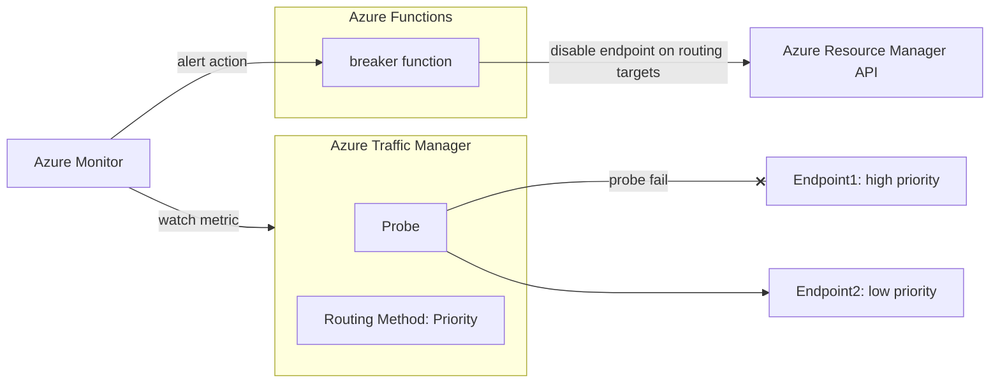

# Simple circuit breaker for Azure Traffic Manager

## Backgroud

[Azure Traffic Manager is useful for site failover](https://learn.microsoft.com/en-us/azure/networking/disaster-recovery-dns-traffic-manager). However, it might fail back before the site has fully recovered because the probe might assume the site has recovered after [a single success](https://learn.microsoft.com/en-us/azure/traffic-manager/traffic-manager-monitoring#endpoint-failover-and-recovery). [The health endpoints that probes check should confirm full recovery](https://learn.microsoft.com/en-us/azure/architecture/guide/design-principles/redundancy), but may not cover complex failures. Failing back due to false negatives has adverse effects such as flapping.

## Solution

* Create a simple circuit breaker to disable the down end points
* The "simple" intent is that it doesn't automatically return the breaker to the closed state, in other words, it doesn't enable the endpoint again. It is assumed that an operator judges whether failback is possible and fails back manually
* Implement the breaker on Azure Functions (Go)
* Azure Monitor check Azure Traffic Manager endpoint status metric and alert to breaker when some endpoints are not online

## Overview

## Conditions for disabling endpoints

* Azure Traffic Manager Routing Method: Priority
* Alert Condition: Fired
* Have multiple endpoints
* Have at least one online endpoint
* Sort endpoints by priority and disable endpoints that not online and have not been disabled. Exit when an online endpoint is found.

## Alert rule example

* "criterionType": "StaticThresholdCriterion"
* "threshold": 0
* "operator": "LessThanOrEqual"
* "timeAggregation": "Minimum"
* "evaluationFrequency": "PT1M"
* "windowSize": "PT1M"

## Room for improvement

* Implement full features of circuit breaker (Transition control Open/Half-Open/Close)
  * But complexity brings risk, so it might be better to give [feedback](https://feedback.azure.com/d365community/idea/9330affc-18c9-ec11-a81b-0022484ee92d?utm_source=pocket_saves) the product handles it.
* Implement unit tests for functions that call Azure Resource Manager APIs
  * [Waiting for SDK support test double](https://github.com/Azure/azure-sdk-for-go/issues/16613)
